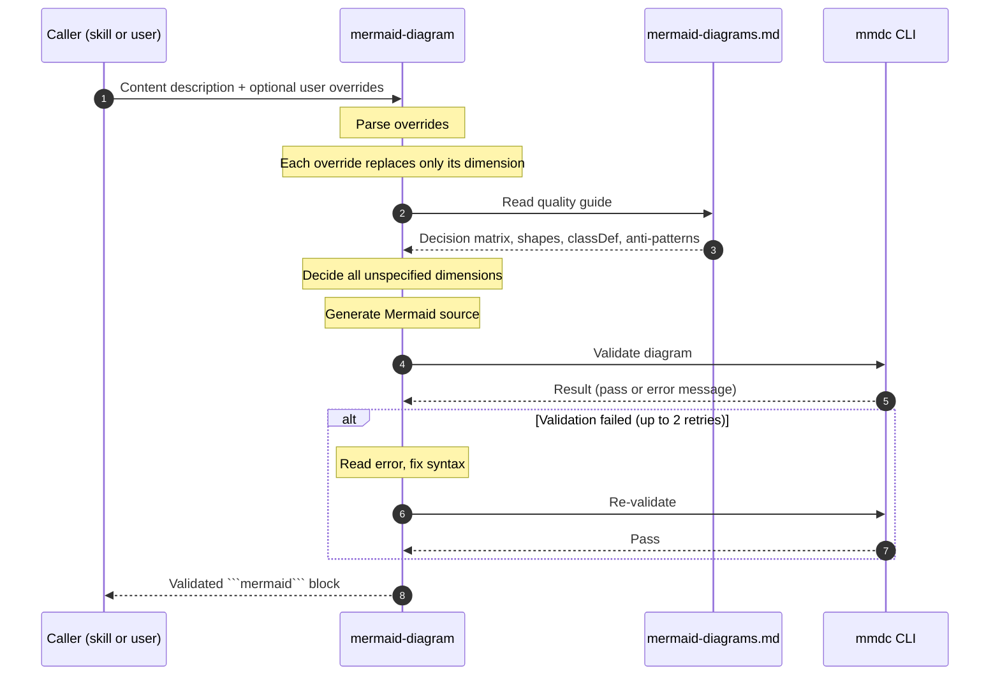

# mermaid-diagram

> A Claude Code skill that generates validated Mermaid diagrams from a content description —
> covering all 23 diagram types with intelligent type selection, v11 syntax, semantic colour
> coding, and `mmdc` validation.

---

## The Problem

Ask an LLM to draw a diagram and it will almost certainly produce a `flowchart TD` with grey
rectangular nodes, regardless of what the content actually calls for. This is not a capability
gap — Mermaid has 23 diagram types and a rich v11 feature set — it is a **training-data
artefact**: `graph TD` is so overrepresented in LLM training corpora that it becomes the
default answer to any diagram request. The specific failure modes, each confirmed through
research and direct observation:

**1. Type defaulting.** LLMs reliably generate only 2–3 of the 23 available Mermaid diagram
types. `mindmap`, `architecture-beta`, `C4Context`, `quadrantChart`, `stateDiagram-v2`,
`timeline`, `erDiagram`, and others are almost never generated without an explicit instruction
naming them — even when they would be unambiguously more appropriate than a flowchart.

**2. Node shapes flattened to rectangles.** Mermaid v11 introduced `@{ shape }` API with 30+
named shapes: cylinders for databases, documents for artefacts, stadiums for terminals, forks
for parallel splits, and more. Current models use only the 3–4 classic delimiter shapes
(`[rect]`, `(round)`, `{diamond}`, `[(cylinder)]`). Everything else becomes a generic box.

**3. No semantic styling.** `classDef` colour coding, `linkStyle` edge differentiation, and
`%%{init}%%` theming are almost never applied. The result: every node is grey, every edge
looks identical, and the reader cannot distinguish a data flow from a control dependency
from an optional path at a glance.

**4. Unlabelled edges.** LLMs frequently omit edge labels entirely, leaving the reader to
infer the relationship from layout and context alone.

**5. Syntax errors go undetected.** Without a validation step, invalid diagrams are silently
embedded and only fail when rendered. A concrete example from this project: `<br/>` inside
`sequenceDiagram` message text is invalid syntax that passes LLM generation unnoticed but
produces a parse error in every Mermaid renderer.

**6. The prior `draw-mermaid-diagram` skill did not address any of this.** It was
interactive-only (no automated generation), covered only 5 of 23 diagram types, contained
no type-selection logic, applied no `classDef` guidance, and required an MCP server
(`veelenga/claude-mermaid`) that was not configured — making it entirely non-functional.

**This skill addresses each point directly:** a 23-type decision matrix forces the right type
choice; the full v11 node shape vocabulary and `classDef` semantic palette are injected into
context before generation; edges are required to carry labels; and every diagram is validated
through `mmdc` before being returned, with automatic correction on failure.

---

## What This Skill Does

Given a description of what a diagram should convey, the skill:

1. Parses any explicit user overrides (type, colour, direction, etc.)
2. Decides all unspecified dimensions using the quality guide in `references/mermaid-diagrams.md`
3. Generates a Mermaid block using the full v11 feature set
4. Validates with `mmdc`; auto-corrects on failure (up to 2 retries)
5. Returns a validated ` ```mermaid ... ``` ` block ready to embed

It replaces the removed `draw-mermaid-diagram` skill, which covered only 5 diagram types,
had no type-selection logic, and required an MCP server that was not configured.

A planned interactive mode (preview in browser → refine → save) is documented as a future
feature in `references/future-interactive-flow.md`.

---

## Directory Structure

```
mermaid-diagram/
├── README.md                        ← this file
├── SKILL.md                         ← orchestrator: generation + validation flow
└── references/
    ├── mermaid-diagrams.md          ← Mermaid v11 quality guide (canonical)
    └── future-interactive-flow.md  ← design notes for the interactive flow feature
```

---

## Primary Flow



---

## Input Contract

The caller provides:

| Input | Required | Description |
|---|---|---|
| Content description | Yes | What the diagram should show — the subject, relationships, and purpose |
| Explicit overrides | No | Any user-specified constraints: diagram type, colour, direction, theme |

**Override semantics:** each override replaces only the specific decision it addresses.
Unspecified dimensions are decided by the skill's normal logic. Examples:

- "Use a sequence diagram" → type is fixed; shapes, colours, `autonumber`, and validation still apply normally
- "Blue for the API nodes" → one `classDef` entry is overridden; all other colour decisions are made by the skill
- "Dark theme" → `%%{init}%%` directive is overridden; type selection and node shapes are not affected

---

## Output Contract

A single validated fenced Mermaid code block:

````markdown
```mermaid
<diagram source>
```
````

No surrounding prose unless the caller explicitly asked for an explanation.
If validation still fails after 2 retries, the block is returned with an inline warning comment.

---

## Diagram Type Decision Matrix (Summary)

The full matrix with rationale lives in `references/mermaid-diagrams.md`. Quick reference:

| Content | Type |
|---|---|
| Concept relationships, problem space | `mindmap` or `graph LR` with subgraphs |
| Service / component topology | `architecture` or `C4Context` / `C4Container` |
| Message passing, API call sequence | `sequenceDiagram` |
| State machine, lifecycle | `stateDiagram-v2` |
| Decision tree, conditional logic | `flowchart TD` with `{diamond}` nodes |
| Tradeoff comparison (2 axes) | `quadrantChart` |
| Chronological phases, roadmap | `timeline` |
| Data entity relationships | `erDiagram` |
| Class hierarchy, OOP | `classDiagram` |
| Data flow by volume | `sankey-beta` |

---

## `mmdc` Validation

Every generated diagram is passed through `mmdc` (mermaid-cli, v11):

```bash
mmdc -i /tmp/mermaid-diagram.mmd -o /tmp/mermaid-diagram.svg 2>&1
```

On failure, `mmdc` returns a specific error message identifying the line and token.
The skill reads the error, fixes the syntax, and re-validates — up to 2 retry cycles.

Install if not present:
```bash
npm install -g @mermaid-js/mermaid-cli --allow-scripts=puppeteer
```

---

## Future: Interactive Flow

A browser-based preview → refine → save mode is planned as a secondary flow.
When triggered, it would open the diagram with live reload, let the user iterate in natural
language, and save to disk on approval.

See `references/future-interactive-flow.md` for the full design, how the removed
`draw-mermaid-diagram` skill implemented this via the `veelenga/claude-mermaid` MCP server,
and evaluation questions to answer before building it.

---

## Dependencies

| Dependency | Required for | Install |
|---|---|---|
| `mmdc` (mermaid-cli v11) | Diagram validation | `npm install -g @mermaid-js/mermaid-cli --allow-scripts=puppeteer` |
