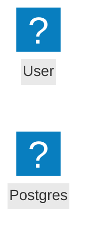
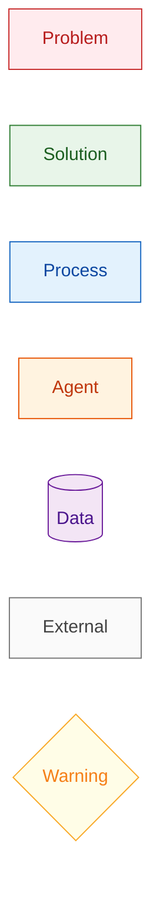
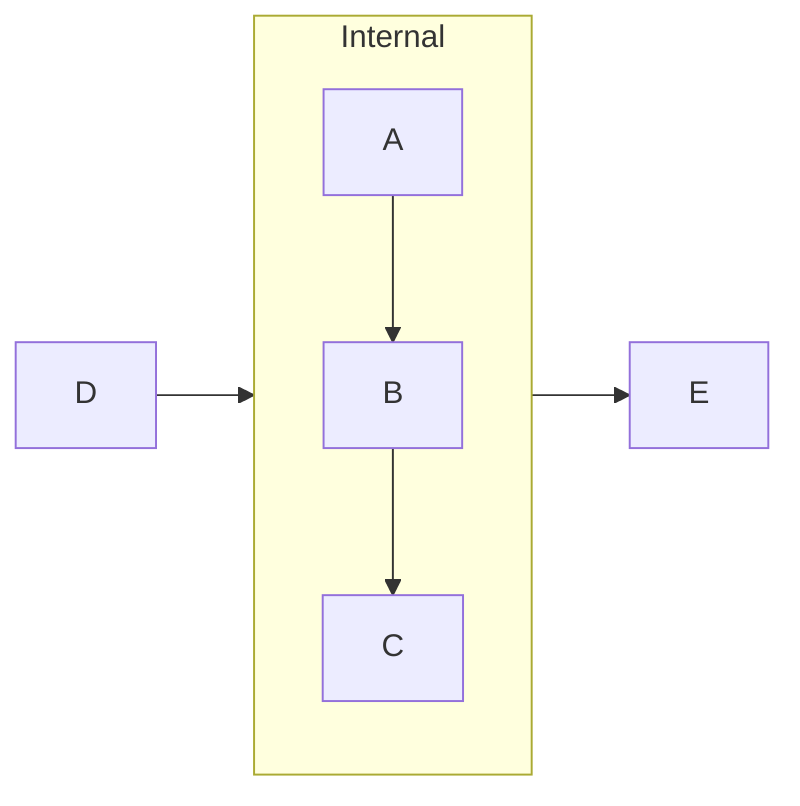
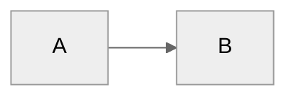
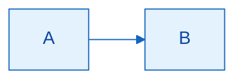
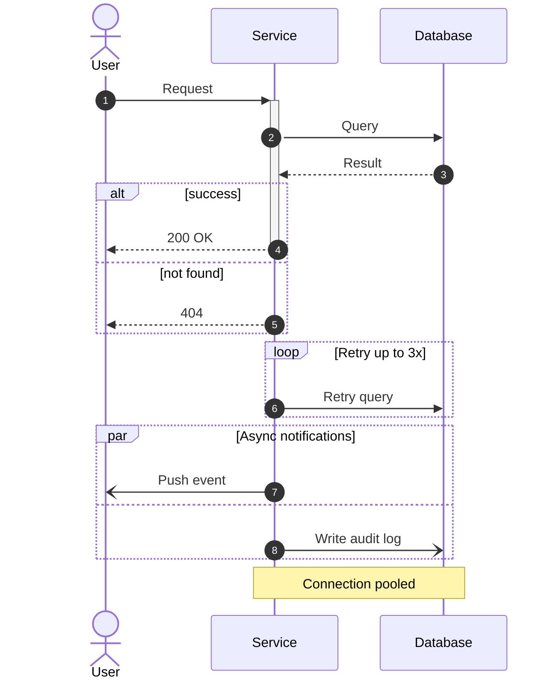
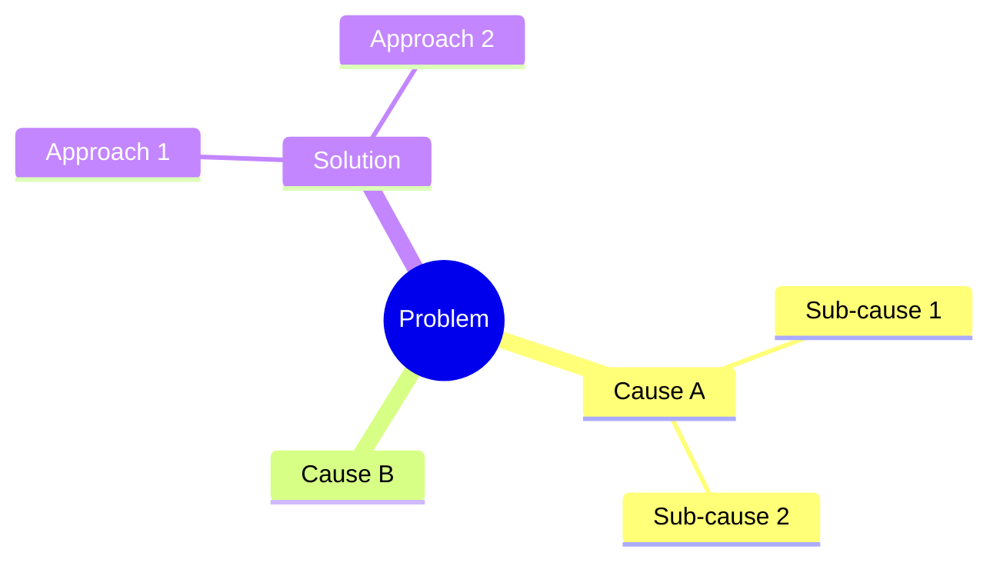
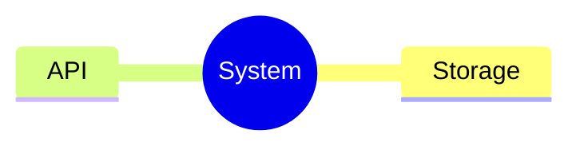
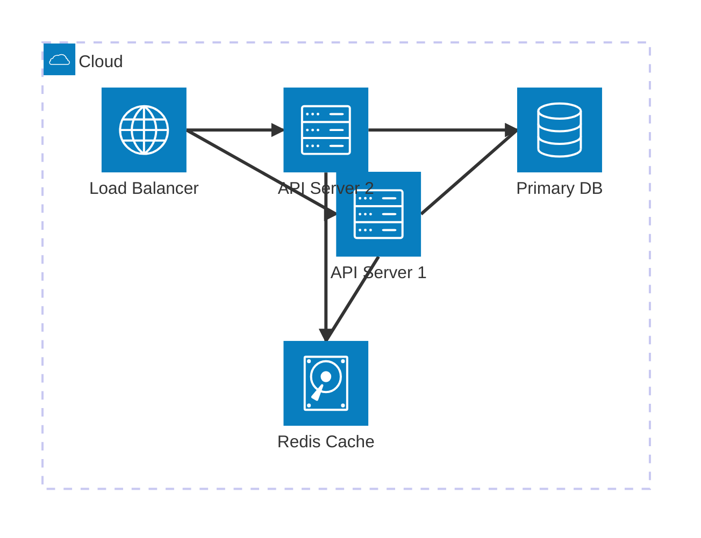

# Mermaid Diagram Quality Guide

Sourced from the official Mermaid v11.0.0 documentation via Context7.
Read this entire file before generating any diagram.

---

## 1. Diagram Type Decision Matrix

The most common LLM mistake is defaulting to `flowchart TD` for every diagram.
Choose the type that matches the **content structure**, not whatever feels familiar.

| Content you are visualizing | Use this type | Why |
|---|---|---|
| Concept relationships, problem space, mental model | `mindmap` | Tree-shaped, hierarchical, no directionality required |
| Problem → solution causal chain with branching | `graph LR` with subgraphs | Horizontal flow reads left-to-right naturally |
| Service topology, infrastructure, cloud architecture | `architecture` | Purpose-built for services, edges, groups, and icons |
| C4 system context or container view | `C4Context` / `C4Container` | Shows people, systems, boundaries as C4 convention requires |
| API call sequence, message passing, protocol | `sequenceDiagram` | Shows order and actors clearly; supports `par`, `alt`, `loop` |
| State machine, lifecycle, FSM | `stateDiagram-v2` | Explicit state and transition vocabulary |
| Decision tree, conditional logic branching | `flowchart TD` with `{diamond}` nodes | The *only* case where `flowchart TD` is the right choice |
| Tradeoff comparison across two dimensions | `quadrantChart` | Plots items on x/y axes with four named quadrants |
| Chronological phases, roadmap, history | `timeline` | Linear time axis with optional sections |
| Data entity relationships, database schema | `erDiagram` | Cardinality notation (`||`, `|{`, etc.) is built in |
| Class hierarchy, OOP structure | `classDiagram` | Inheritance, composition, method/attribute notation |
| Git branching history | `gitGraph` | Shows commits, branches, merges exactly |
| Data flows by volume (pipeline throughput) | `sankey-beta` | Width of flow encodes magnitude |
| Comparative bar/line metrics | `xychart-beta` | Both bar and line on one chart |
| Requirement traceability | `requirementDiagram` | Links requirements to satisfying elements |
| Block layout with explicit column grid | `block-beta` | Precise spatial placement when topology matters |

**Anti-pattern:** Using `flowchart TD` with rectangular boxes for everything that is not a
decision tree. If your diagram has no `{diamond}` decision nodes, it probably isn't a flowchart.

---

## 2. Flowchart Node Shapes

### Classic delimiter shapes (all Mermaid versions)

```
[text]         rectangle (default)         — use for: process steps, generic entities
(text)         rounded rectangle           — use for: start/end terminals, soft concepts
([text])       stadium / pill              — use for: external triggers, user inputs
[[text]]       subroutine                  — use for: reusable procedures, function calls
[(text)]       cylinder / database         — use for: data stores, queues, databases
((text))       circle                      — use for: event nodes in state diagrams
>text]         asymmetric / flag           — use for: document outputs, artifacts
{text}         rhombus / diamond           — use for: decisions, conditionals
{{text}}       hexagon                     — use for: preparation steps (not decisions)
[/text/]       parallelogram lean-right    — use for: data input/output
[\text\]       parallelogram lean-left     — use for: manual operations
[/text\]       trapezoid                   — use for: manual input
[\text/]       trapezoid alt               — use for: manual output
(((text)))     double circle               — use for: end states
```

### New `@{ shape }` API (Mermaid v11+)

The `@{ }` block decouples shape from delimiter. Prefer this when you want semantic shape names
without worrying about the correct delimiter character.

```mermaid
flowchart LR
    A@{ shape: cylinder,  label: "Database" }
    B@{ shape: stadium,   label: "Start / End" }
    C@{ shape: diamond,   label: "Decision?" }
    D@{ shape: hexagon,   label: "Preparation" }
    E@{ shape: parallelogram, label: "I/O" }
    F@{ shape: subroutine, label: "Sub-process" }
    G@{ shape: lean-right, label: "Data In" }
    H@{ shape: lean-left,  label: "Data Out" }
    I@{ shape: trapezoid,  label: "Manual Input" }
    J@{ shape: double-circle, label: "End" }
    K@{ shape: notch-rect, label: "Document" }
    L@{ shape: bow-rect,   label: "Stored Data" }
```

The `@{ }` block also accepts `label` and `icon` (requires Font Awesome):



---

## 3. Edge / Link Types

```
A --> B           solid arrow (default)
A --- B           solid line, no arrow
A ==> B           thick arrow (emphasis, data flow)
A -.-> B          dotted arrow (optional / async dependency)
A --o B           circle end (weak association)
A --x B           cross end (blocking / exclusion)
A <--> B          bidirectional arrow
A -- label --> B  labeled edge (always preferred over unlabeled)
```

Use different edge types to encode semantics — e.g., solid for control flow,
dotted for optional dependencies, thick for primary data flow.

---

## 4. `classDef` Color Patterns

Define classes for semantic color coding. Apply with `:::className` inline or `class A,B,C name`.

### Recommended semantic palette



Color semantic guide:
- **red tones** — problems, failures, error states
- **green tones** — solutions, success states, outputs
- **blue tones** — processes, steps, transformations
- **orange tones** — agents, actors, users
- **purple tones** — data, storage, queues
- **grey tones** — external systems, out-of-scope
- **yellow tones** — warnings, caveats, conditional paths

---

## 5. `linkStyle` Edge Styling

Override specific edges by zero-based index (order of declaration):

```
linkStyle 0 stroke:#2196f3,stroke-width:2px
linkStyle 1 stroke:#e53935,stroke-width:2px,stroke-dasharray:5 5
linkStyle 2 stroke:#43a047,stroke-width:3px
```

Common use: highlight the "happy path" vs. error paths in different colors.

---

## 6. Direction Heuristics

| Direction | Use when |
|---|---|
| `LR` (left-right) | Pipeline flows, data transformation chains, process sequences |
| `TD` (top-down) | Hierarchies, org charts, inheritance trees, decision trees |
| `BT` (bottom-top) | Dependency graphs ("X depends on Y" reads bottom to top) |
| `RL` (right-left) | Rarely useful; avoid unless the domain convention requires it |

In `subgraph` blocks you can override direction locally:



---

## 7. `%%{init}%%` Theming

Apply a theme or fine-grained variable overrides at the top of any diagram:



Available themes: `default` | `dark` | `forest` | `neutral` | `base`

Custom variables (use with `'theme': 'base'`):



For summaries, use `neutral` theme by default for clean, light-background rendering.
Use `dark` theme only when the surrounding document is dark-mode.

---

## 8. Sequence Diagram Reference



Arrow types in sequenceDiagram:
```
A->>B      solid arrow (sync call)
A-->>B     dashed arrow (async / response)
A-)B       open arrow (fire-and-forget)
A-xB       cross (explicitly failed call)
A->>+B     activate B (show activation bar)
B-->>-A    deactivate B
```

---

## 9. `mindmap` Reference

Node shape is set by delimiter (not by `@{ shape }` — mindmap has its own syntax):

```
Root text          default rounded rectangle
[text]             rectangle
(text)             rounded rectangle
((text))           circle
)text(             cloud / irregular
))text((           bang / explosion
{{text}}           hexagon
```

Depth is expressed by indentation only — no arrows:



Use `::icon(fa fa-...)` to add Font Awesome icons to any node:



---

## 10. `architecture` Diagram Reference (Mermaid v11)

Purpose-built for service topology. Uses `service`, `junction`, `group`, and `edge` vocabulary:



Icons use the format `(iconName)` — available sets: `cloud`, `server`, `database`, `disk`,
`internet`, `logos`. For a full icon list see the Mermaid icon registry.

Edge direction suffixes: `T` (top), `B` (bottom), `L` (left), `R` (right).

---

## 11. Anti-Patterns to Avoid

| Anti-pattern | What to do instead |
|---|---|
| Using `flowchart TD` with only rectangular nodes | Choose the type from the decision matrix that matches the content structure |
| Using `{{text}}` (hexagon) for decision diamonds | Use `{text}` for diamonds |
| Long node labels inline (`A["This is a very long sentence that wraps badly"]`) | Break at ~30 chars with `\n`; or use `@{ shape: ..., label: "..." }` |
| No `classDef` — every node is grey | Apply the semantic color palette from Section 4 |
| Unlabeled edges | Label every edge; unnamed arrows force the reader to guess the relationship |
| More than ~15 nodes in one diagram | Split into two focused diagrams; add a third if needed |
| Putting all content in one flat `flowchart` | Use `subgraph` blocks to group related nodes |
| Using `sequenceDiagram` for non-message-passing flows | `sequenceDiagram` is for protocols; use `flowchart LR` for pipelines |
| Forgetting `autonumber` in sequence diagrams | Add `autonumber` to every `sequenceDiagram` |
| Not validating syntax with `mmdc` | Always run validation; silent rendering failures are common |
